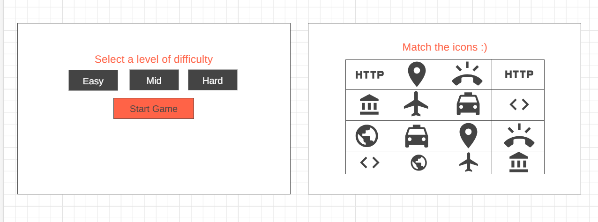
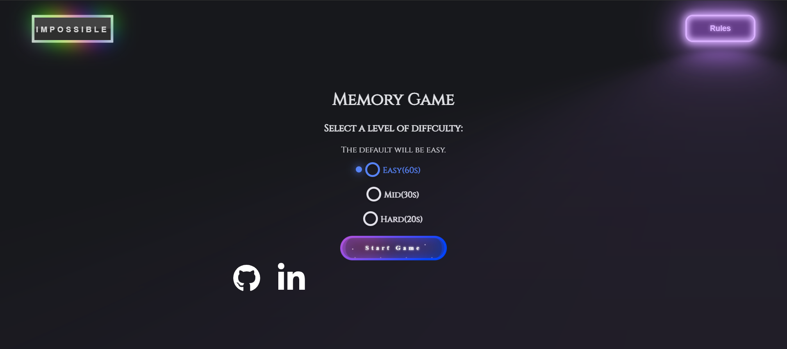
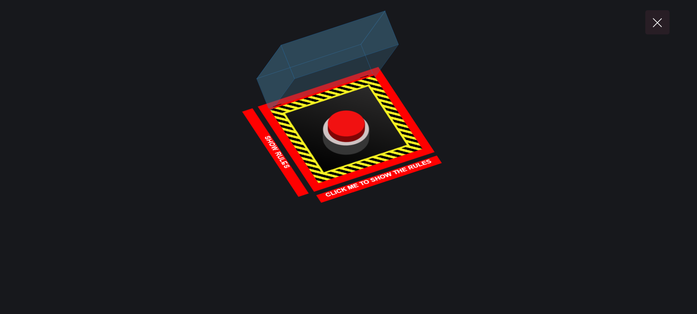
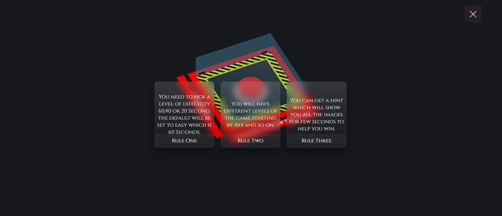
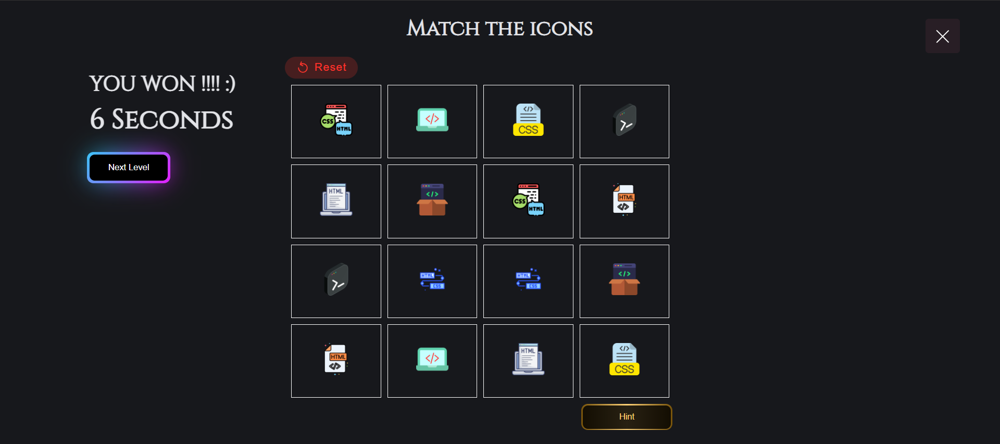
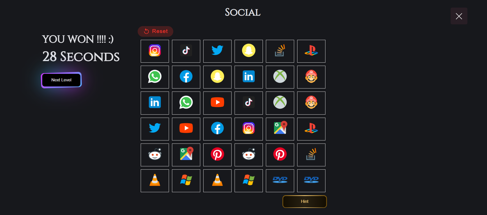
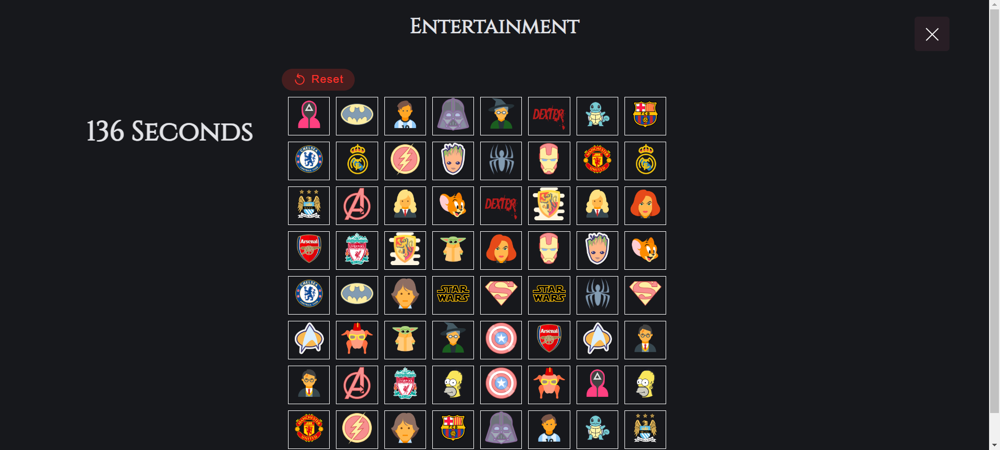
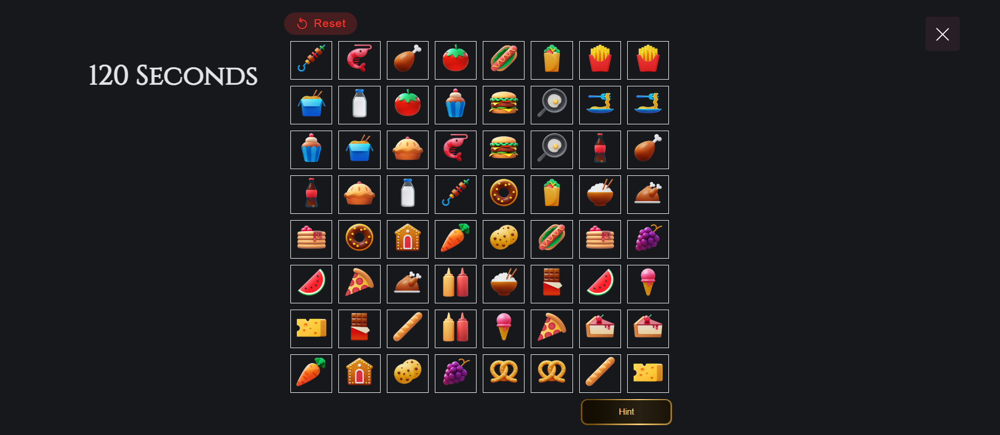

# MemoryGame

## Date : 1/18/2024

### Made By: Fatima Fouad

---

### **_Description_**

#### Memory Game is a game where you will have 4x4 table that has icons and the you have to remember the icons and match them in a specific time frame, there would be 3 main levels of diffculty where each level has a different timer, including an 'impossible level' , timers options :

- Easy: 60S
- Mid: 40S
- Hard: 20S

---

### **_Game Link:_**

##### Live Link: [MemoryGame](https://smemorygameffh.surge.sh)
##### Faster Live Link: [MemoryGame] (https://tmdb--profound-haupia-997501.netlify.app/index.html)
### **_Extra Levels Updates_**

- [ ] 6x6 Matching
- [ ] 8x8 Matching

---

### My Screenshots:

##### Memory Game Map:

## 

##### Home Page:

## 

##### Rules Page:

## 

## 

##### Level One 4x4 Page:

## 

##### Level Two 6x6 Page:

## 

##### Level Three 8x8 Page:

## 

##### Impossible level 8x8 Page:

## 

### Technologies used

- [x] VSCode (Editor for Writing the Code)
- [x] HTML (Structure of the pages)
- [x] CSS (Style of the pages)
- [x] JavaScript (Functionality for the pages)
- [x] WireFrame (Early map desgin of the game)
- [x] Google Fonts (Fonts for the page)
- [x] Trelllo (Managment for the work)
- [x] Surge (Deployment of the game)

---

### What I have learned:

- [x] Manage my work on trello.
- [x] hwo to write code more efficiently.
- [x] Deployment on Surge.
- [x] writing the logic of fliping more than one card and havnig them stay if they match and disappear if they don't.

---

### What I am most proud of is the logic behind the card flipping and the event listeners for each icon:

```
  icon1IMG.innerHTML = ''
  let icon1Interval = 0
  icon1Interval = setInterval(() => {
    if (icon1MatchIMG.innerHTML == '') {
      icon1IMG.innerHTML = ''
      clearInterval(icon1Interval)
      Win--
      CheckWin()
    } else {
      icon1IMG.innerHTML = ''
      clearInterval(icon1Interval)
    }
  }, 2000)

```

```
setTimeout(function ShowHints() {
    if (icon1IMG.innerHTML === '') {
      icon1IMG.innerHTML = ''
      icon1Exist = false
    }
....
  }, 100)

 setTimeout(function deleteHints() {
    if (!icon1Exist) {
      icon1IMG.innerHTML = ''
    }
   .....

  }, 500)
```

---

### Future plans:

- [ ] Have more levels 10x10 and 12x12.
- [ ] Have more categories for each level.
- [ ] Have more pictures that are random and not fixed.

---

### **_Credits_**

##### WireFrame: [MGMap](https://wireframe.cc/qBbFEG)

##### Icons: [Icons](https://icons8.com/icons)

##### Programming Icons: [PIcons](https://www.flaticon.com/search/2?word=coding)

##### Buttons and style: [buttons](https://uiverse.io/)

##### Google fonts: [fonts](https://fonts.google.com/)
