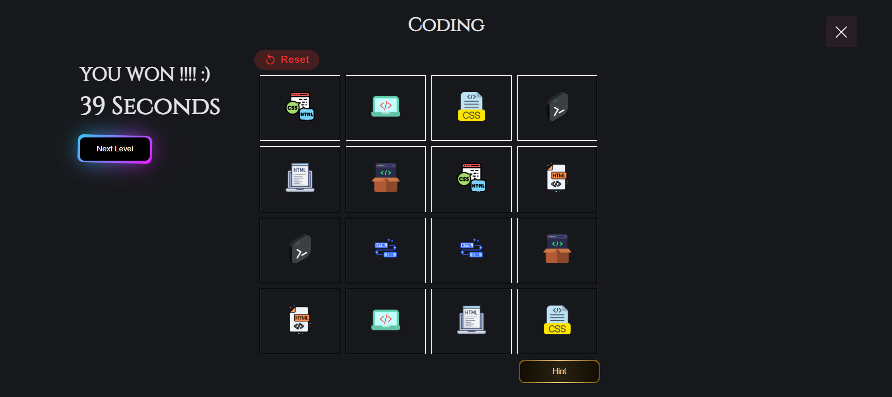
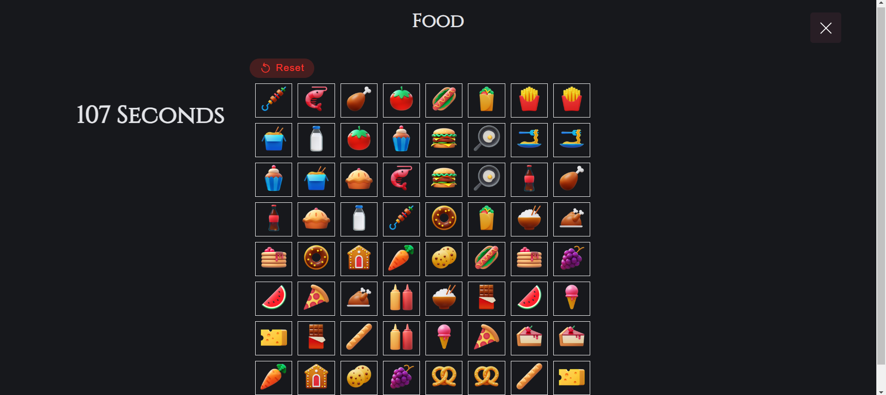

# MemoryGame

## Date : 1/18/2024

### Made By: Fatima Fouad

---

### **_Description_**

#### Memory Game is a game where we will have 4x4 boxes that has icons and the user have to remember the icons and match them, there would be 3 levels of diffculty where each level has a different timer, levels :

- Easy: 60S
- Mid: 40S
- Hard: 20S

---

### **_Extra Levels Updates_**

- [ ] 6x6 Matching
- [ ] 8x8 Matching

---

### My Screenshots:

##### Memory Game Map:

## 

##### Home Page:

## 

##### Rules Page:

## 

## 

##### Level One 4x4 Page:

## 

##### Level Two 6x6 Page:

## 

##### Impossible level 8x8 Page:

## 

### **_Credits_**

##### WireFrame: [MGMap](https://wireframe.cc/qBbFEG)

##### Icons: [Icons](https://icons8.com/icons)

##### Programming Icons: [PIcons](https://www.flaticon.com/search/2?word=coding)

##### Buttons and style: [buttons](https://uiverse.io/)

##### Google fonts: [fonts](https://fonts.google.com/)
